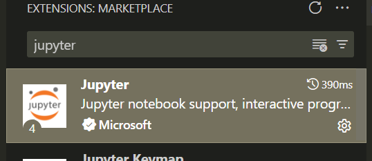
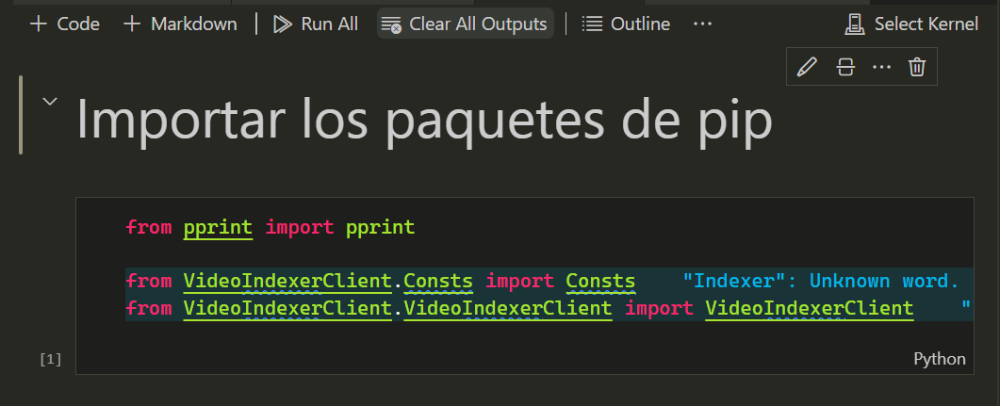
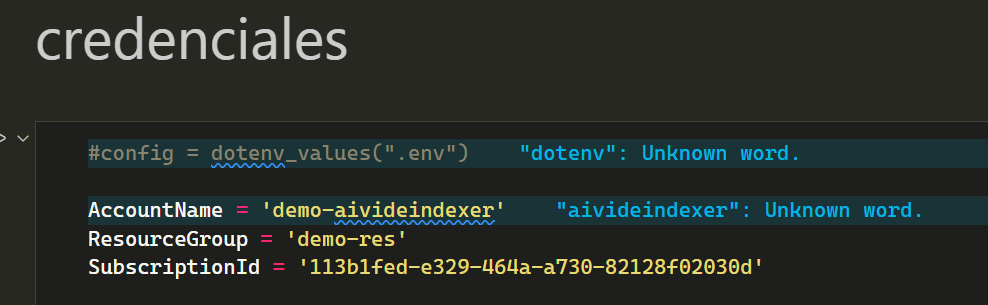
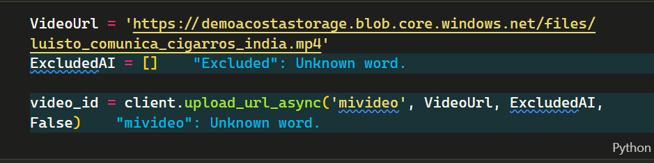

# Utilizar Video Indexer con Python

link de repositorio de python aqui [Repositorio de Python con Video Indexer](https://github.com/Azure-Samples/azure-video-indexer-samples/tree/master/API-Samples/Python).

Descargarlo en tu PC el repositorio anterior

# Instalar las dependencias de python 

Asegurate de tener instalado `pip `, con el comando
~~~
pip --version
~~~

Si ocurre un error, instala `pip` 

### Recursos para intalar pip

- [https://docs.aws.amazon.com/es_es/elasticbeanstalk/latest/dg/eb-cli3-install-windows.html](https://docs.aws.amazon.com/es_es/elasticbeanstalk/latest/dg/eb-cli3-install-windows.html)

### Comando para instalar las dependencias

~~~
pip install -r requirements.txt
~~~

# Descargar la extensiones de Visual Studio Code

Descarga la extensión de jupyter de visual studio code, para habilitar la opción de abrir archivos de extensiones de `.ipynb` 

Si ya descargate la extensión se mostraran los archivos `.ipynb` con esta interfaz

# Modificar el archivo test.ipynb

Vas a modificar estas partes código con las credenciales que aparecen
al crear un servicio de **Viode Indexer** de **Azure** de tu **PROPIA CUENTA**

# Subir un video en Azure con la cuenta de Storage

- Investigar como subir un video en Azure con una cuenta de Storage de manera que se genere una URL de video publica

- Una vez que tiene esa URL ingresarla en la variable `VideoUrl`
- Modificar la la parte `mivideo` para asignarle un nombre a ese video que se va a `indexar`

# Ejecutar el archivo `Test`

Darle en `Run all` y en la parte de `Select Kernel` escoges el interprete de python 

